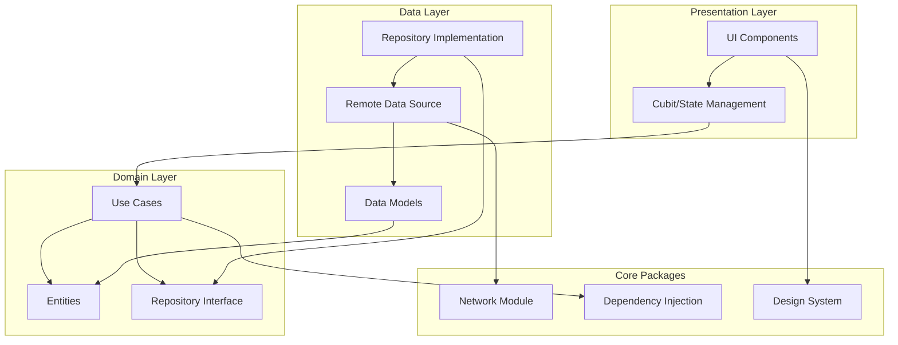

# Cinemak - Flutter Movie App

## Project Architecture

This project follows Clean Architecture principles with a modular structure, separating responsibilities into different layers and modules.

### Project Structure

```
cinemak/
├── app/                 # Main application
├── features/           # Feature modules
│   ├── details/        # Movie details module
│   └── home/          # Home screen module
└── packages/          # Shared packages
    ├── design_system/ # Design system
    ├── injection/     # Dependency injection
    └── network/       # Network configuration
```

### Architecture Diagram



### Architecture Layers

1. **Presentation (UI)**
   - Implements user interface using Flutter
   - Uses BLoC/Cubit pattern for state management
   - Reusable widgets and screens

2. **Domain**
   - Contains business logic
   - Defines entities and use cases
   - Repository interfaces

3. **Data**
   - Repository implementations
   - Data sources (API, local storage)
   - Data mapping (DTOs)

### Main Modules

#### 1. App
- Initial application setup
- Global dependency injection
- Main navigation

#### 2. Features
- **Home**: 
  - Popular movies list
  - Navigation to details
  - State management with HomeCubit
  
- **Details**:
  - Detailed movie view
  - Complete movie information

#### 3. Packages
- **Design System**:
  - Reusable UI components
  - Consistent themes and styles

- **Injection**:
  - Dependency injection configuration
  - Service management

- **Network**:
  - HTTP Client (Dio)
  - Interceptors
  - Error handling

### Technologies and Patterns

- **Flutter**: UI Framework
- **Modular**: Navigation and module management
- **Bloc/Cubit**: State management
- **Get_it**: Dependency injection
- **Dio**: HTTP Client
- **Freezed**: Code generation

### Main Features

1. **Movie Catalog**
   - Popular movies list
   - Search and filtering
   - Real-time updates

2. **Movie Details**
   - Detailed information
   - High-quality images
   - Ratings and reviews

3. **UI/UX**
   - Modern and attractive design
   - Fluid animations
   - Optimized dark theme

### Data Management

- Repository Pattern implementation
- Error and loading state handling
- Data model mapping

### Development Guide
## How to build and run the app
1. Clone the repository: `git clone https://github.com/LazaroMakario/Cinemak.git`
2. Install dependencies: `flutter pub get`
3. Generate build_runner files with command: `flutter pub run build_runner build --delete-conflicting-outputs`
4. Run the app: `flutter run`

